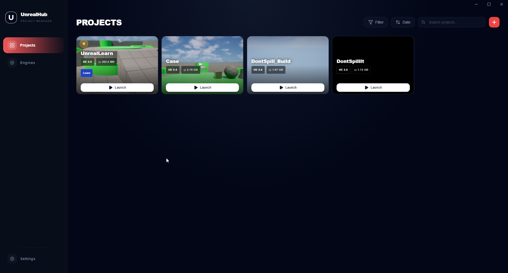
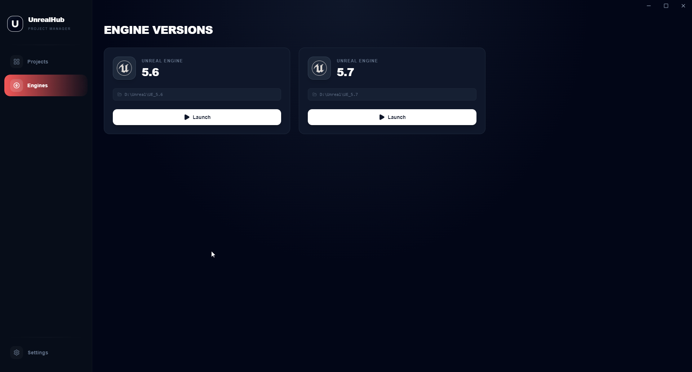
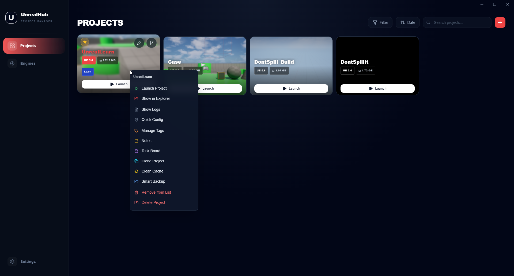
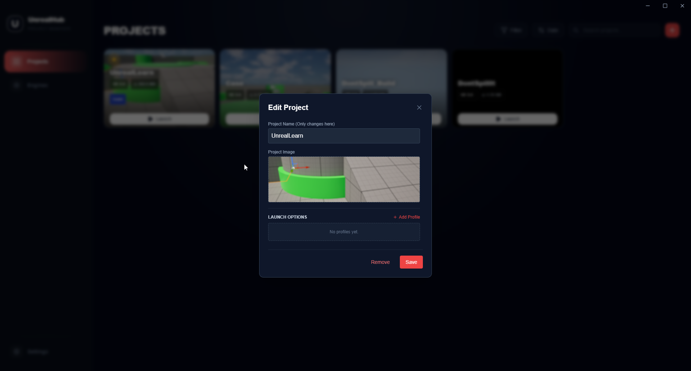
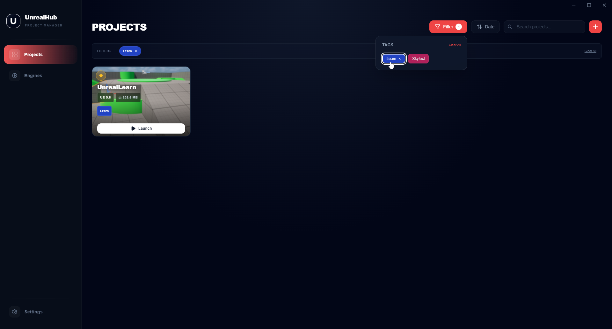
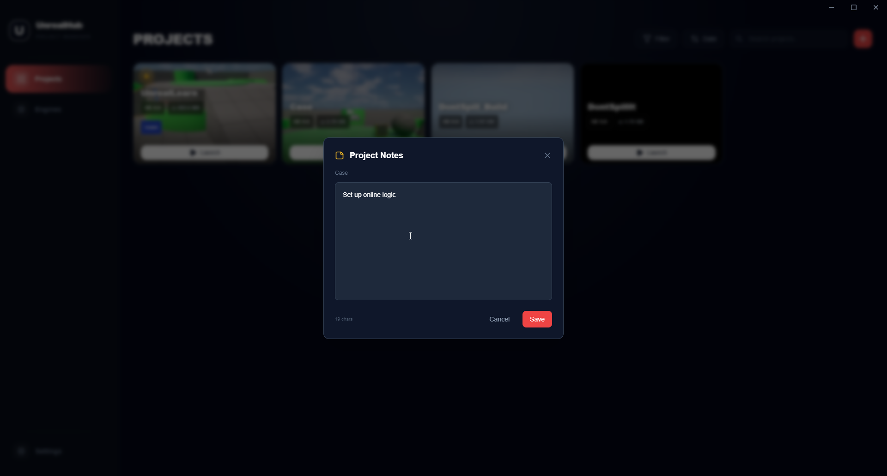
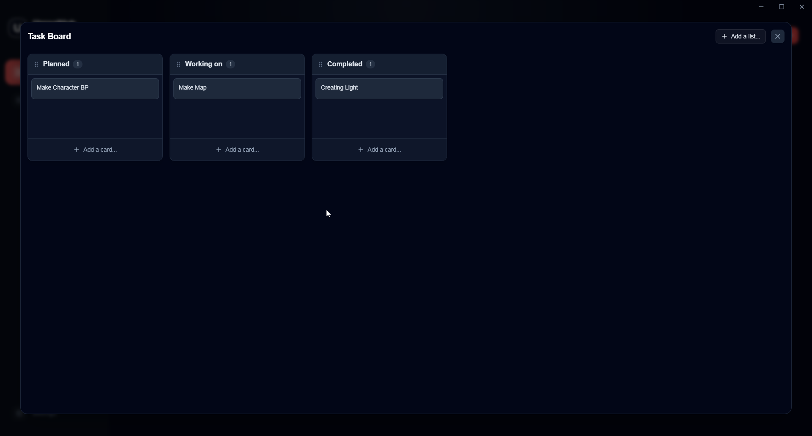
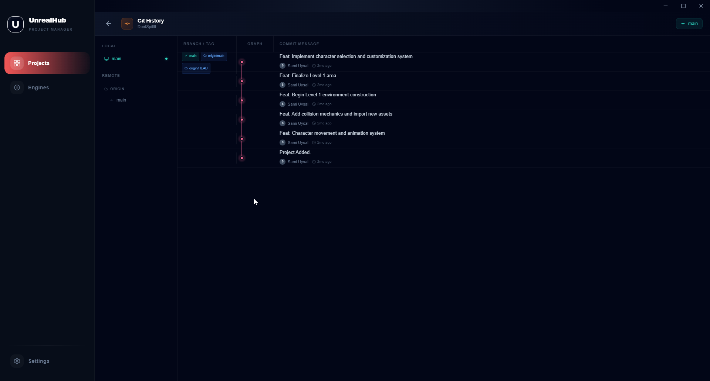
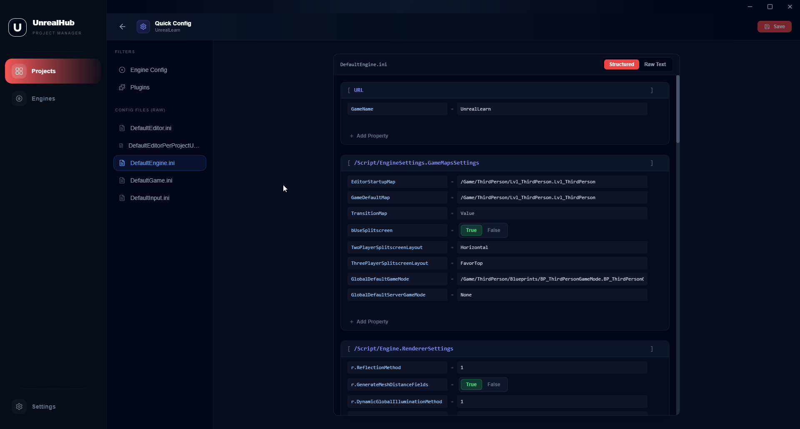

# UnrealHub
**The Lightweight, Open-Source Alternative to Epic Games Launcher for Unreal Engine Developers.**

[TR](README.md) | **EN** | 🌐 **[Website](https://unrealhub.samiuysal.me)**

Tired of waiting for the Epic Games Launcher to open just to start your project? **UnrealHub** is a lightning-fast, bloat-free desktop application designed specifically to manage your Unreal Engine projects and engines seamlessly.



## Epic Games Launcher vs. UnrealHub

| Feature | Epic Games Launcher | UnrealHub |
|---------|---------------------|-----------|
| **Launch Speed** | ~10-15 Seconds | **< 1 Second** |
| **Focus** | Store & Games | **Purely Your Projects** |
| **Telemetry/Tracking**| Yes | **No (Open Source)** |
| **Offline Mode** | Clunky | **Native** |

## Why UnrealHub?

- **Instant Launch:** View all your UE projects and launch them with a single click.
- **Bloat-Free:** No storefronts, no ads, no background tracking.
### Engine Management
Automatically detects installed Unreal Engine versions. View and manage your engines in one place.



### Advanced Project Management
Automatically calculate and display the actual disk size of each project. Use the Context Menu to clone, delete, or clean `Saved`/`Intermediate` cache folders, or create smart **.zip backups** to save space directly from the app.



### Customization & Tags
Change project names, and cover images to customize the look of your projects.


Create your own organization logic by adding Tags to your projects.


### Power User Tools

**Project Notes (Markdown)**
Jot down ideas, to-dos, and project details directly into the built-in notes panel.


**Task Board (Kanban)**
Built-in drag-and-drop task board to manage your project tasks directly in the launcher.


**Git Integration**
Visualize commit history and branches seamlessly within the app.


**Plugin & Config Editor**
Comprehensive built-in editor to enable/disable `.uproject` plugins or edit settings like `DefaultEngine.ini` without opening the engine!


## Installation

Ready to speed up your workflow? 

**[Download the latest `.exe` from Releases](https://github.com/Sami-Uysal/UnrealHub/releases)** 

*One-click installation: Download and start using it in seconds!*

## Flow Launcher Integration
Boost your productivity even further! Use our official **[Flow Launcher Plugin](https://github.com/Sami-Uysal/Flow.Launcher.Plugin.UnrealHub)** to search and launch any Unreal Engine project straight from your keyboard (`Alt + Space`).

## Development

<details>
<summary>Click to view development instructions</summary>

```bash
# Install dependencies
npm install

# Run in development mode
npm run dev

# Build for distribution
npm run build
```

The installer is created in the `release/` folder.

**Technologies Used:** Electron, React + TypeScript, Vite, TailwindCSS
</details>

## License
This project is open-source and free to use.
